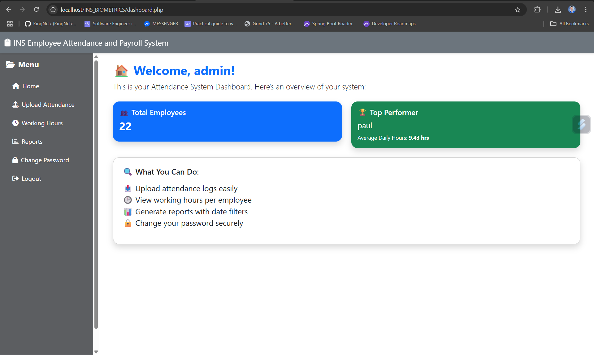
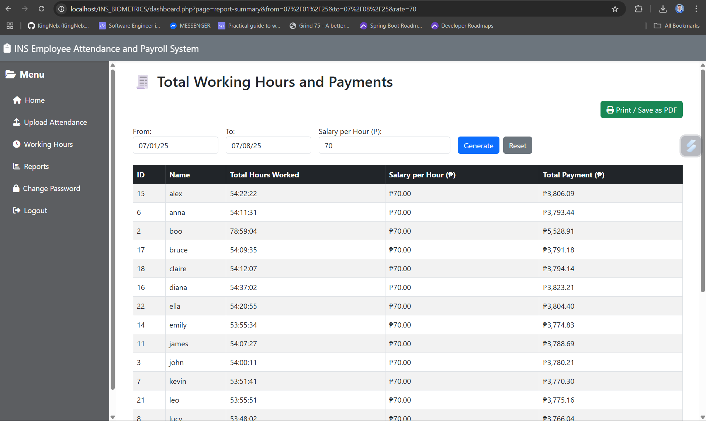

# 🛠️ INS Biometrics Attendance System

A web-based attendance tracking system designed for small businesses with 30+ employees. This system allows administrators to upload attendance logs from a fingerprint device, calculate working hours, and generate payroll reports with ease.

## 📌 Features

- 📤 Upload fingerprint attendance logs via CSV
- 🕒 View daily working hours per employee
- 📊 Generate summary reports with salary calculations
- 📅 Filter reports by custom date ranges
- 🖨️ Print and export reports as PDF
- 🔒 Secure login system and password management
- 📁 Duplicate entry detection during upload
- 🌙 Clean dark-themed dashboard UI (modern and mobile-friendly)

## 🖥️ Tech Stack

- **Frontend**: HTML, Bootstrap 5, Flatpickr
- **Backend**: PHP (procedural)
- **Database**: MySQL
- **Other**: Font Awesome, JavaScript

## 🚀 Installation & Setup

1. **Clone the repository:**

   ```bash
   git clone https://github.com/your-username/ins-biometrics-attendance.git
Set up the database:

Open phpMyAdmin or MySQL Workbench

Create a database named attendance_system

Import the SQL file provided (attendance_system.sql)

Configure the database connection:

In your PHP files (e.g., dashboard.php, upload-processor.php), update:

php
Copy
Edit
$host = "localhost";
$username = "root";
$password = "";
$database = "attendance_system";
Start the server:

If using XAMPP or WAMP, place the project folder inside htdocs/ and open your browser at:

bash
Copy
Edit
http://localhost/INS_BIOMETRICS/dashboard.php
🔐 Default Admin Login
txt
Copy
Edit
Username: admin
Password: admin123
(You can change the credentials in the database users table.)

📁 Upload Format
The system accepts .csv or .txt files in the following format (tab-separated):

pgsql
Copy
Edit
ID	Name	Department	Time	            Device ID
1	Paul	Not Set1	07-01-2025 10:41:09	1
⚠️ Make sure your file follows the exact structure to avoid import errors.

📈 Dashboard Stats
👥 Total number of employees

🏆 Top performer with highest average working hours

✨ Screenshots


🧑‍💻 Built for small businesses that need accurate, flexible, and modern attendance tracking.

Let me know if you want it tailored with your GitHub username, real email, or include screenshots and badges